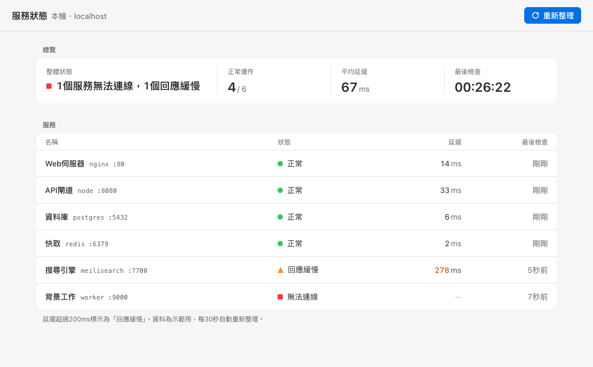
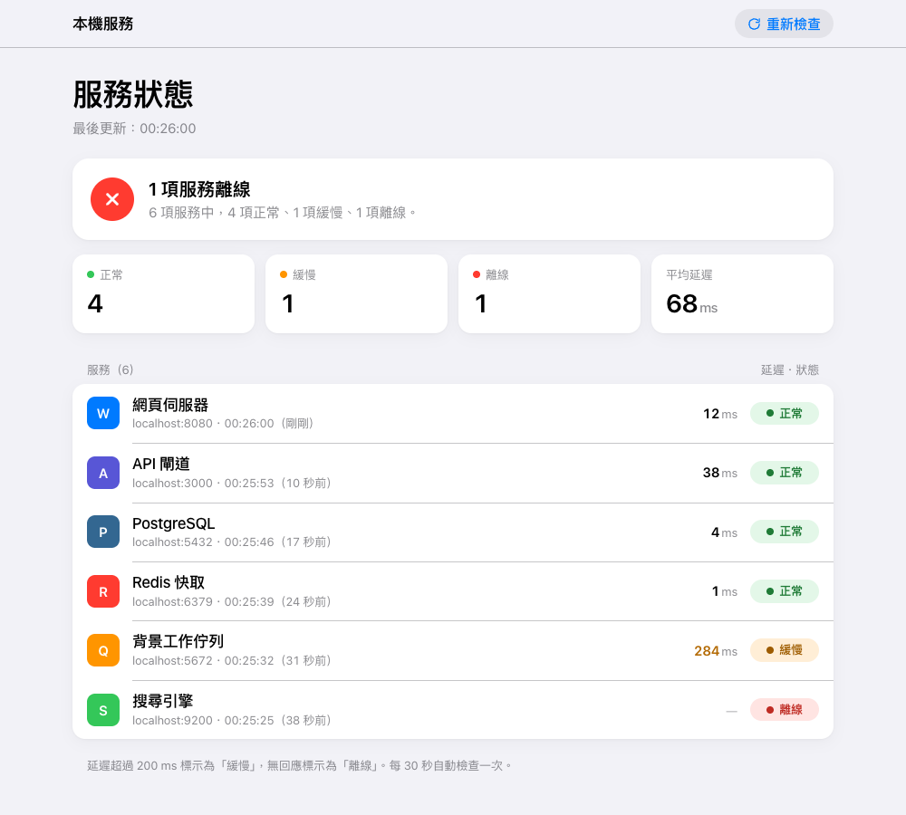

# hig42-design

**Evidence-based design guidelines for AI coding agents building on Apple platforms.**
Part of the **42 series** by [Okle42](https://github.com/Okle42) — follow for more AI tools that actually ship.
A [Claude Code](https://claude.com/claude-code) skill covering SwiftUI / AppKit / UIKit on iOS/iPadOS 26–27 and macOS 26–27 (Liquid Glass), plus Apple-style web pages. Every value is tagged with where it came from.

[繁體中文說明](README.zh-TW.md)

---

## Why

iOS 26 and macOS 26 replaced most of the design system: new system colors, Liquid Glass, taller controls, concentric corners. Models trained on older material still write `#007AFF`, hard-code 22-pt buttons, put glass on list rows, and copy WWDC sample code that no longer compiles.

This skill gives the agent current, verified answers instead:

| What models usually get wrong | What this skill says |
|---|---|
| System blue is `#007AFF` | Since iOS 26 / macOS 26 it's `#0088FF` (dark `#0091FF`), and default system colors mostly fail 4.5:1 as small text on white |
| `.rect(corner: .containerConcentric)` (WWDC25 sample) | Doesn't exist in the shipping SDK — use `.rect(corners: .concentric)` |
| Opt out of Liquid Glass with `UIDesignRequiresCompatibility` | Ignored when you build with Xcode 27 |
| Glass on cards and list cells | Glass is for the functional layer only; never glass on glass |
| macOS body text at 17 pt | macOS body is 13 pt; Headline is Bold 13 |
| An 8-pt grid is an Apple rule | It isn't — industry convention |
| Settings window with OK / Apply | Changes apply immediately; Settings lives under the app menu, ⌘, |

## What's inside

| File | Covers |
|---|---|
| `SKILL.md` | Routing by scenario, 10 core principles, most-used values, top mistakes, review checklist |
| `references/typography-layout.md` | Text styles (iOS & macOS tables), margins, hit targets, macOS control heights, concentric corners, CJK fallback |
| `references/color-materials.md` | 2025+ system color table (incl. increased contrast), semantic colors, materials, dark mode, contrast math |
| `references/liquid-glass.md` | SwiftUI / AppKit / UIKit glass APIs, what changed in 27, migration, fallbacks, whole-window glass panels |
| `references/macos-components.md` | Windows, menu bar, menu bar extras, panels, alerts, Settings, controls, motion, SF Symbols |
| `references/charts-live-data.md` | Swift Charts, live numbers, Gauge, status colors, widgets |
| `references/notifications-background.md` | Notifications, permission prompts, login items, `LSUIElement`, menu bar / app icons |
| `references/accessibility.md` | VoiceOver labels, keyboard, macOS text size, audits, Accessibility Nutrition Labels |
| `references/web.md` | App-style vs marketing-style web, licensing do's and don'ts, "AI-generated look" → Apple approach |
| `references/zh-tw-writing.md` | Traditional Chinese UI terminology as macOS actually uses it, and English capitalization rules |
| `assets/apple-web-base.css` | Drop-in CSS tokens: system colors, light/dark/high-contrast, grouped lists, switches, segmented controls |

## How it was verified

- **Apple docs & HIG** read as DocC JSON (September 2026 snapshot).
- **API names and availability** checked against the Xcode 27.0 SDK; **every Swift sample type-checks** for macOS 26 / iOS 26.
- **Measured** on macOS 27.0 and the iOS 26.5 Simulator: control heights, semantic colors, font fallback, contrast ratios.
- **Two independent cross-check rounds**: 68 claims sampled (10 wrong, fixed), then 27 claims (8 wrong, fixed).
- Evidence tags on every rule: **[Official] [SDK] [Measured] [Third-party] [Inferred]**. 145 source links in [`SOURCES.md`](SOURCES.md).

## Does it help? (small A/B test)

Same three prompts, run once with and once without the skill, graded on 12–13 objective checks each:

| Task | With skill | Without |
|---|---|---|
| macOS menu bar temperature monitor (SwiftUI) | 12/12 | 10/12 |
| Apple-style service dashboard (HTML) | 12/12 | 9/12 |
| Review a flawed SwiftUI settings screen | 13/13 | 13/13 |

Honest caveats: three prompts, one run each, checks written by the author (prompts and grader are in [`evals/`](evals/)). The gains are in details — high-contrast support, a removable menu bar icon, no negative letter-spacing on CJK text, no outdated `#007AFF`. The skill roughly doubles tokens and time.

| With skill | Without skill |
|---|---|
|  |  |

## Install

**Claude Code (plugin)**

```
/plugin marketplace add Okle42/hig42_design
/plugin install hig42-design@okle42          # English
/plugin install hig42-design-zh-tw@okle42    # 繁體中文
```

**Claude Code (manual)**: copy `plugins/hig42-design/skills/hig42-design` to `~/.claude/skills/hig42-design`.

**Claude.ai**: download the `.skill` file from [Releases](https://github.com/Okle42/hig42_design/releases) and upload it in Claude.ai's Skills settings.

Install one edition, not both — they cover the same ground and would compete for the same requests.

The skill triggers on its own when you ask for Apple-platform UI or an Apple-style page, or when you ask for a HIG review.

## Repository layout

```
.claude-plugin/marketplace.json   the "okle42" marketplace (both editions)
plugins/hig42-design/             English edition — skills/hig42-design/{SKILL.md, references/, assets/}
plugins/hig42-design-zh-tw/       Traditional Chinese edition (same structure)
evals/                            A/B test prompts, input and grading script
tools/                            check.py (repo checks) · package.py (builds .skill files)
SOURCES.md · CHANGELOG.md · CONTRIBUTING.md
```

Found a wrong value or an outdated API? Open a [correction](https://github.com/Okle42/hig42_design/issues/new/choose) with a source — see [CONTRIBUTING.md](CONTRIBUTING.md).

## Limits

- Strongest on macOS; iOS is solid, iPadOS/visionOS/watchOS/tvOS are thin.
- iOS measurements come from the iOS 26.5 Simulator (the iOS 27 Simulator wasn't available).
- The whole-window glass panel section is a single measured case ([cool42](https://github.com/Okle42/cool42)) and a deliberate deviation from the HIG.
- Current as of September 2026. The next WWDC will change things.

## About Okle42

Okle42 is the name I publish my tools under — the **42 series**. Each one is built with AI agents and shipped with its evidence: tests, measurements and independent cross-checks.
This skill is an example: research agents read around 400 sources in parallel, a separate agent cross-checked the result twice, and every code sample was compiled. The whole run took about an hour of wall-clock time.

⭐ Star this repo and follow [@Okle42](https://github.com/Okle42) to see the next tools. Questions and requests go in [Issues](https://github.com/Okle42/hig42_design/issues) or [Discussions](https://github.com/Okle42/hig42_design/discussions).

## Disclaimer

This project is not affiliated with, authorized, sponsored, or endorsed by Apple Inc. Apple, macOS, iOS, iPadOS, SF Symbols, Liquid Glass and related marks are trademarks of Apple Inc. The content is the author's implementation guide based on public documentation and measurements. It is not Apple documentation and does not reproduce it.

## License

[MIT](LICENSE) © 2026 Okle42
